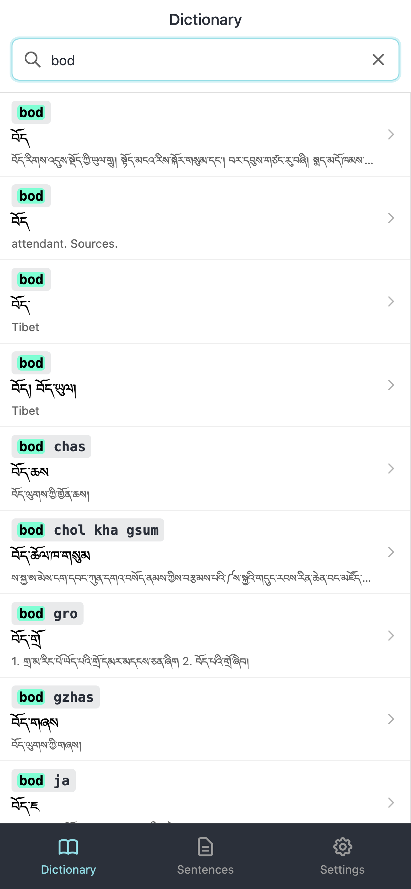
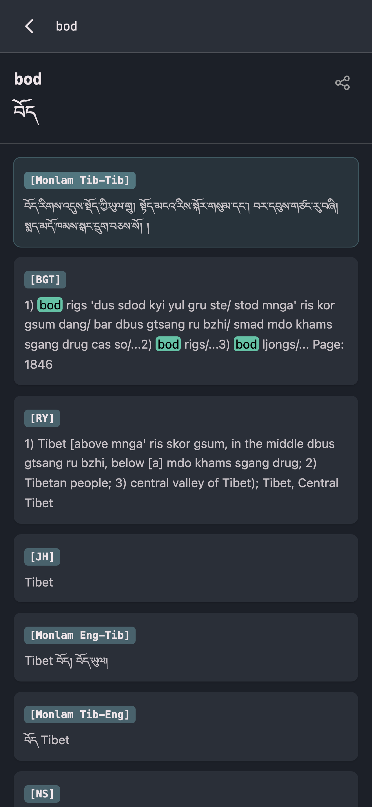
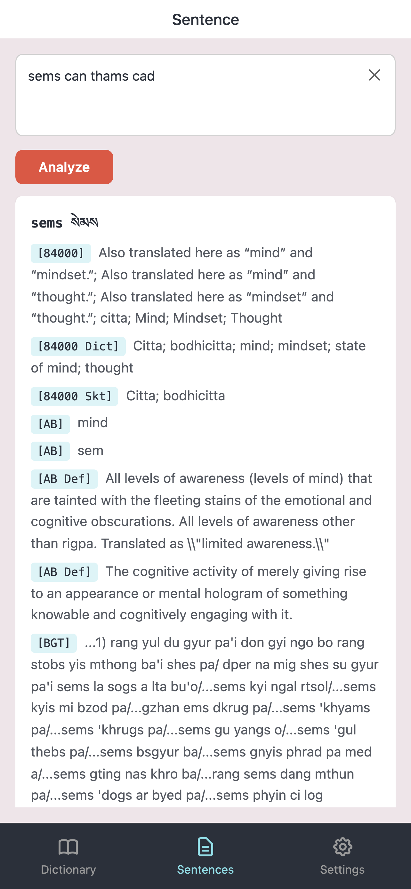

<h1 align="center">
   
  
   
  myTibetan
   
</h1>

<h3 align="center">The most comprehensive offline Tibetan dictionary for iOS, Android, Mac, and Windows</h3>

  <em>Designed for the benefit of all beings</em>

  
  
  

  
  
  
  

---

## What is myTibetan?

**myTibetan** is a free, professional-grade Tibetan dictionary and translation app that brings **multiple authoritative dictionaries** together in one place. Built for students, scholars, translators, and Buddhist practitioners, it lets you search in Wylie transliteration, Tibetan Unicode (བོད་ཡིག), or English - all completely offline.

Completely rebuilt from the ground up in version 3.0 with a modern native interface, blazing-fast search, and powerful features like sentence analysis and bidirectional Wylie-Unicode conversion.

  
  &nbsp;&nbsp;
  
  &nbsp;&nbsp;
  

## Key Features

### Dictionary Search

- **Search across multiple dictionaries simultaneously** - Wylie, Tibetan Unicode, or English
- **Instant results** with search term highlighting across scripts
- **Tap any result** to see full descriptions from all dictionary sources
- **Share entries** via clipboard, Google Translate, or your notes app
- **Bidirectional Wylie-Unicode conversion** - type in one script, find in both

### Sentence Analysis

- **Paste or type Tibetan text or Wylie** and get automatic word-by-word breakdowns
- **Each word shows definitions** from all matching dictionaries
- **Results sorted by dictionary** for consistent, easy browsing
- **Perfect for reading practice**, translation work, and study

### Customization

- **Dark and light themes** with automatic system preference detection
- **Adjustable font size** from 50% to 200%
- **Control results per dictionary** (1-100) to tune search density
- **Enable or disable individual dictionaries** to focus your search
- **Auto-focus search** option for power users

### Works 100% Offline

All 19 dictionaries are bundled with the app. **No internet connection required** - search, analyze sentences, and study anywhere.

## Included Dictionaries

myTibetan bundles the largest collection of Tibetan dictionaries available in any single app:

| Abbreviation | Dictionary | Languages |
|---|---|---|
[AB] | Alex Berzin Dictionary Courtesy of Alex Berzin Archives, https://studybuddhism.com | Tib-Eng
[ABD]|Alex Berzin Definitions Courtesy of Alex Berzin Archives, https://studybuddhism.com | Tib-Eng
[BGT]| bod rgya tshig mdzod chen mo| Tib-Tib
[CT]| Computer Terms| Tib-Eng
[DM] |Dan Martin| Tib-Eng
[DKT]| dung dkar tshig mdzod chen mo| Tib-Tib
[84000]| 84000 translation project glossary| Tib-Skt-Eng
[84000 Dict] |84000 translation project glossary| Tib-Eng
[84000 Skt]| 84000 translation project glossary| Tib-Skt
[IW+RY]| Ives Waldo and Rangjung Yeshe| Tib-Eng
[JA]| Heinrich August Jäschke (Jaschke, H., 1882)| Tib-Skt-Eng
[JH] |Jeffrey Hopkins| Tib-Skt-Eng
[Monlam Eng-Tib]| Monlam| Eng-Tib
[Monlam Tib-Eng]| Monlam| Tib-Eng
[Monlam Tib-Tib]| Monlam| Tib-Tib
[NS] |J.S.Negi| Tib-Skt
[RB] |Richard Barron| Tib-Eng
[TTP]| Tibetan Terms Project| Tib-Eng
[VERBS] |Nathan W. Hill Verbinator 2010| Tib-Eng
[YR-E]| Yuri Roerich (1933)| Tib-Skt-Eng
[YR-R]| Yuri Roerich (1933)| Tib-Rus

## Platforms

| Platform | Minimum Version | Download |
|---|---|---|
| **iPhone & iPad** | iOS 14.0+ | [App Store](https://apps.apple.com/app/mytibetan/id1436723937) |
| **Android** | Android 7.0+ | [Google Play](https://play.google.com/store/apps/details?id=com.rahmobile.myTibetan) |
| **macOS** | macOS 10.13+ | [GitHub Releases](https://github.com/radiantspace/mytibetan.app/releases) |
| **Windows** | Windows 10+ | [GitHub Releases](https://github.com/radiantspace/mytibetan.app/releases) |

## Built With

myTibetan is a modern, cross-platform native app built with open-source technologies:

- **[Tauri 2](https://v2.tauri.app/)** - lightweight native app framework
- **[Svelte 5](https://svelte.dev/)** - reactive UI framework
- **[Rust](https://www.rust-lang.org/)** - high-performance backend and SQLite engine
- **[TypeScript](https://www.typescriptlang.org/)** - type-safe frontend logic
- **[Tailwind CSS](https://tailwindcss.com/)** - utility-first styling
- **SQLite** - embedded dictionary database for instant offline queries

## Support the Developer

myTibetan is completly free. If you find it useful for your Tibetan studies, please consider:

- Leaving a review on the [App Store](https://apps.apple.com/app/mytibetan/id1436723937) or [Google Play](https://play.google.com/store/apps/details?id=com.rahmobile.myTibetan)
- [Supporting development](https://donate.stripe.com/14AbJ2fu98D8fHf5ZlcjS00) with a donation
- Sharing the app with fellow students and practitioners

## Privacy

myTibetan works entirely offline. Your searches and study data never leave your device. Anonymous, aggregated usage analytics help improve the app - no personal data is collected.

## License

This project is licensed under the [MIT License](LICENSE).

## Contact

- **Issues:** [GitHub Issues](https://github.com/radiantspace/mytibetan.app/issues)
- **Email:** mytibetan.app@gmail.com

---

  <strong>བོད་སྐད། - Tibetan Dictionary - Wylie Transliteration - Buddhist Studies - Offline Translation</strong>
   
  myTibetan - Search multiple Tibetan dictionaries offline. Wylie, Unicode, English and Russian (Русский)!

